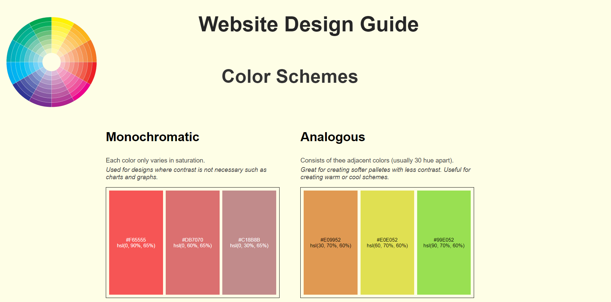
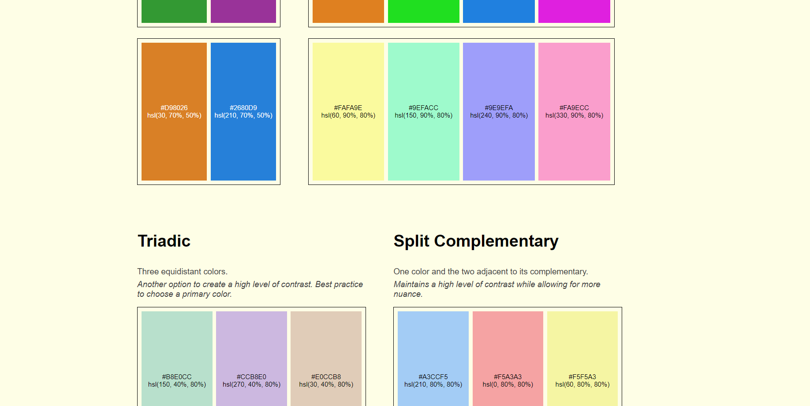
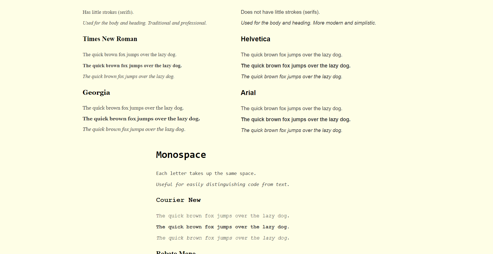

[Homepage](../)

For this project, I am improving my skills in the design aspect of web development. This project uses CSS grid and reports on design principles that I've learned: font-selection and color theory. I am also using Figma for this project to create a wireframe and prototype.

