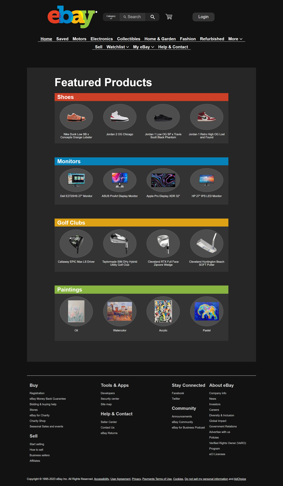
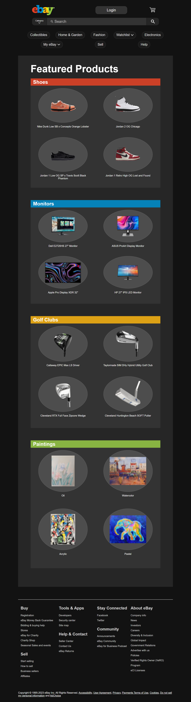
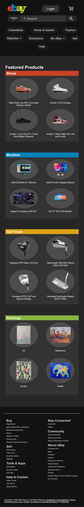

In this project, I redesign the eBay home webpage ([see original](resources/images/previews/original.png)). I created a prototype in Figma. This project uses CSS Flexbox and Grid. Additionally, it works optimally for all screen sizes.

<table>
    <tr>
        <th>Laptop</th>
        <th>Tablet</th>
        <th>Mobile</th>
    </tr>
    <tr> 
        <td valign="top"><a><a></td>
        <td valign="top"></td>
        <td valign="top" style="word-wrap"></td>
    </tr>
</table>