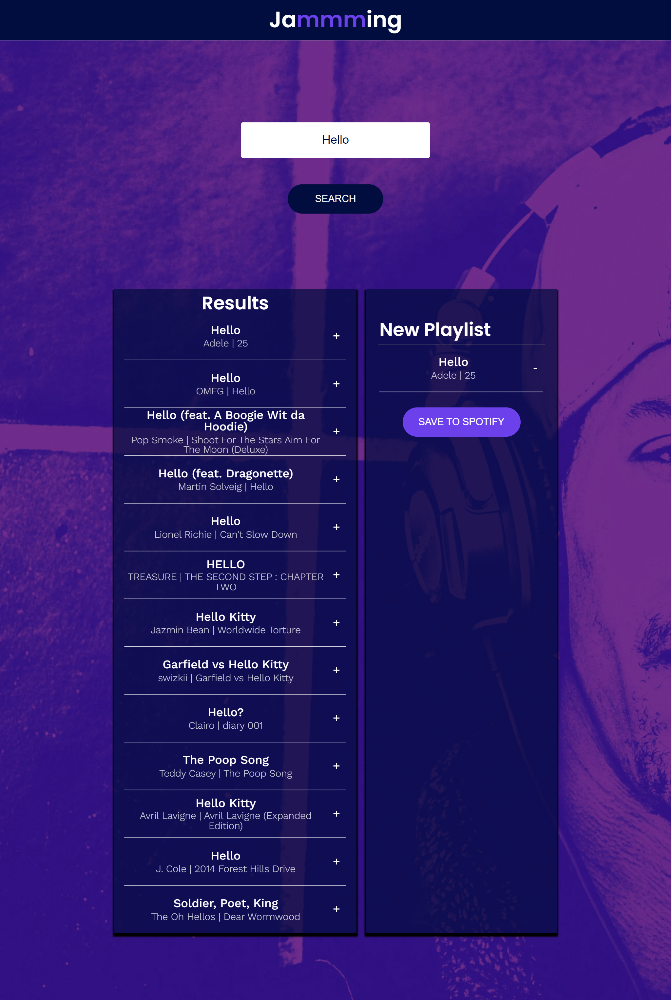

This project uses React, Javscript, and the spotify API to make an app for creating spotify playlists. This project uses OAuth 2.0 to allow the application to create a spotify playlist on the user's account.

